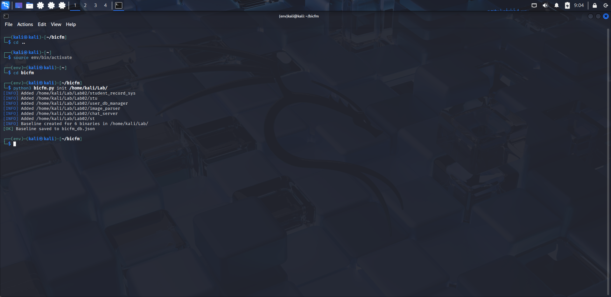
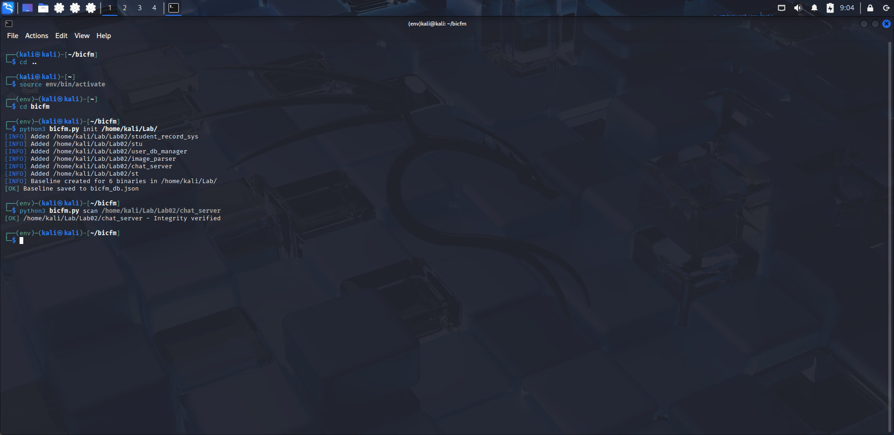
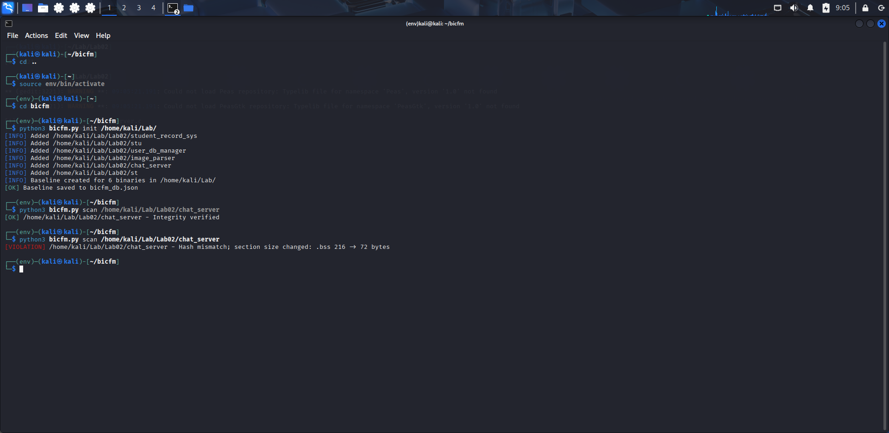
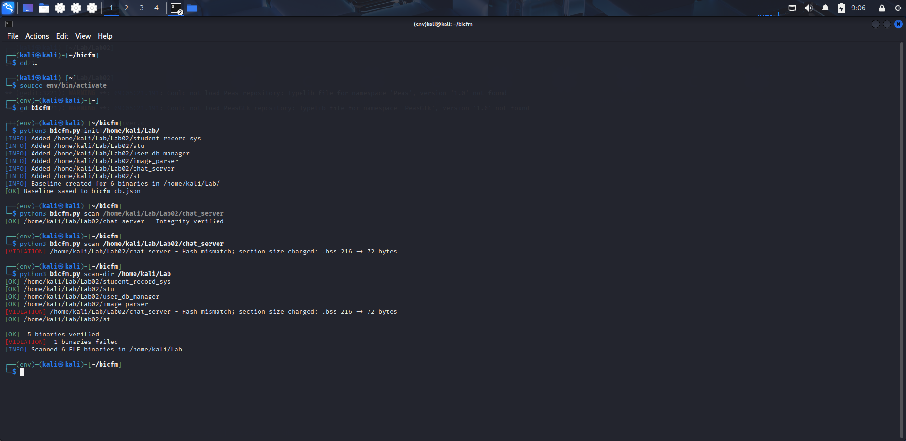
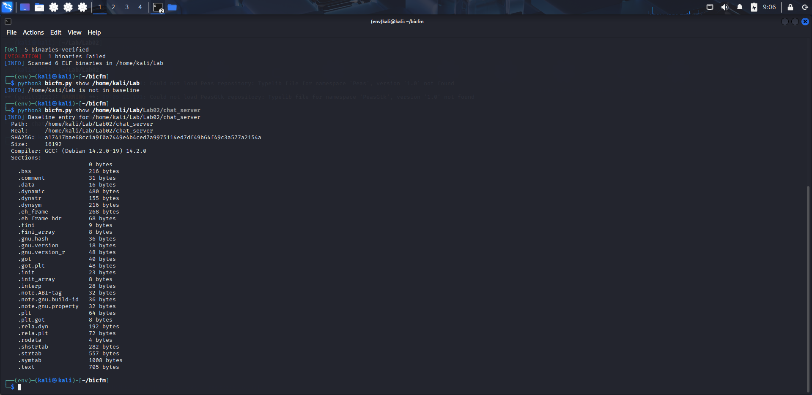

# Binary Integrity & Control Flow Monitor (BICFM) — Part 1

**bicfm** is a small CLI utility to build and verify a baseline for ELF binaries.  
It stores a JSON baseline that includes SHA256, size, ELF section names/sizes and basic compiler metadata. Use it to detect tampering, suspicious changes, or integrity violations.

---

## Features
- `init <dir>` — create baseline for all ELF binaries in a directory  
- `scan <file>` — check a single binary against the baseline  
- `scan-dir <dir>` — scan all ELF binaries in a directory and print a summary  
- `show <file>` — display baseline information for a single binary  
- Color-coded CLI output (green = OK, yellow = Suspicious, red = Violation, blue = Info)  
- Baseline stored as JSON (default `./bicfm_db.json`)  
- Optional `--db` to control the DB path

---

## Requirements (tested on Kali Linux)
- Python 3.8+  
- `pyelftools` (install in a virtualenv)  
- `colorama` (install in a virtualenv)

---

## Installation & setup (recommended: virtual environment)

```bash
# create project folder (if needed) and go there
mkdir -p ~/bicfm
cd ~/bicfm

# create the virtual environment (install python3-venv if needed)
sudo apt update
sudo apt install -y python3-venv

python3 -m venv venv
source venv/bin/activate

# upgrade pip and install libs inside venv
pip install --upgrade pip
pip install pyelftools colorama

# create or copy bicfm.py into this folder and make it executable
chmod +x bicfm.py
```

> **Note:** Kali/Debian enforce PEP 668. Use a virtual environment or pipx; don't pip-install into the system Python. If you must scan system directories, run just the scan/init command with `sudo` (keep the code and venv in a user directory).

---

## Quick usage

```bash
# Initialize baseline for /bin (writes bicfm_db.json to cwd by default)
./bicfm.py init /bin

# Scan a single file
./bicfm.py scan /bin/ls

# Scan entire directory
./bicfm.py scan-dir /bin

# Show baseline entry for a file
./bicfm.py show /bin/ls

# Use a custom DB path
sudo ./bicfm.py --db /var/lib/bicfm/db.json init /usr/bin
./bicfm.py --db /var/lib/bicfm/db.json scan /usr/bin/ls
```

---

## Where is the DB saved?
- **Default**: `./bicfm_db.json` (current working directory)  
- Override with `--db /path/to/baseline.json` for all commands.

**Recommendation**
- During development / grading: keep DB in the repo (default).  
- For per-directory monitoring: place DB inside scanned directory (beware `sudo`/permissions).  
- For centralized monitoring: use a system path like `/var/lib/bicfm/db.json`.

---

## Output meanings (color-coded)
- **Green — [OK]**: Hash and metadata match (integrity verified).  
- **Yellow — [SUSPICIOUS]**: Hash may match but metadata differs (sections/sizes/compiler).  
- **Red — [VIOLATION]**: Hash mismatch (likely tampering).  
- **Blue — [INFO]**: informational messages (missing from baseline, DB not found, etc).

---

## File format (baseline JSON)
Each entry keyed by the binary's `realpath` and contains:

```json
{
  "path": "/bin/ls",
  "realpath": "/usr/bin/ls",
  "sha256": "<hex>",
  "size": 12345,
  "sections": { ".text": 1234, ".rodata": 234, ... },
  "compiler": "GCC: (Ubuntu 9.3.0-...)"
}
```

---

## Examples (copy-paste)

```bash
# create baseline for /bin
./bicfm.py init /bin

# scan an individual binary
./bicfm.py scan /bin/ls

# scan a directory and see summary
./bicfm.py scan-dir /bin

# show baseline details
./bicfm.py show /bin/ls
```

---

## Testing ideas
1. `init` on `/bin` or `/usr/bin` to create a baseline.  
2. Copy a binary, modify a few bytes (or use a simple hex edit), run `scan` on the modified file to see `VIOLATION`.  
3. Rebuild a binary or change compiler flags to test `SUSPICIOUS` (section sizes or `.comment` change).  
4. Use `objcopy --add-section` to add a fake section and confirm `SUSPICIOUS` detection.

---

## Troubleshooting
- **Permission errors**: use `sudo` for `init` when scanning protected directories. Keep the DB and code in a user-writable path.  
- **No DB found**: run `init` first or pass `--db /path/to/db.json`.  
- **False positives after upgrades**: binaries change when packages update — refresh baseline with `init` after legitimate upgrades.

---

## Placeholders for images (replace `1` with `2`, `3`, `4`, ... for each image)
Place your screenshots in the `images/` folder and use these placeholders in the README/report. Replace `1` with the appropriate image number for each figure.


*Figure 1: `bicfm init /bin` output (screenshot placeholder)*


*Figure 2: `bicfm scan /bin/ls` showing an OK result (screenshot placeholder)*


*Figure 3: `bicfm scan /bin/cp` showing a VIOLATION (screenshot placeholder)*


*Figure 4: `bicfm scan-dir /bin` summary (screenshot placeholder)*


*Figure 5: `bicfm show /bin/ls` output (screenshot placeholder)*


---

## Extending the tool (ideas)
- `update <file>` or `update-dir` to selectively refresh entries.  
- Add timestamps and author fields to baseline entries.  
- Store section-level deep hashes (SHA256 per-section).  
- CSV export of scan results.  
- Integrate logging/syslog or a central aggregation server.

---

## License & Author
- Author: Aditya Pillai  
- License: MIT
---

